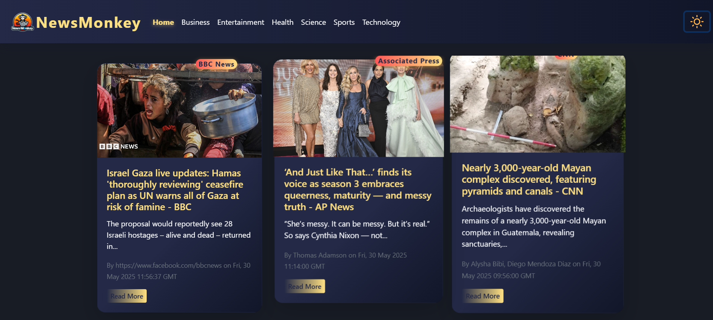

# 📰 NewsMonkey

A modern, responsive news website built with React, featuring live headlines, category browsing, and a beautiful light/dark theme toggle.



---

## 🚀 Features

- **Live News**: Get the latest headlines from around the world.
- **Category Browsing**: Filter news by Business, Entertainment, Health, Science, Sports, and Technology.
- **Responsive Design**: Looks great on desktop and mobile.
- **Light/Dark Theme**: Toggle between light and dark modes for comfortable reading.
- **Animated UI**: Smooth transitions and interactive elements for a delightful experience.

---

## 🛠️ Getting Started

Clone the repository and install dependencies:

```bash
git clone https://github.com/your-username/newsmonkey.git
cd newsmonkey
npm install
```

### Set up your API key

This project uses [NewsAPI.org](https://newsapi.org/) for fetching news.  
Create a `.env` file in the root directory and add:

```
REACT_APP_NEWS_API=your_newsapi_key_here
```

---

## 📦 Available Scripts

In the project directory, you can run:

- `npm start` — Runs the app in development mode.
- `npm test` — Launches the test runner.
- `npm run build` — Builds the app for production.
- `npm run eject` — Ejects the app for full configuration control.

---

## 📸 Preview


---

## 🌐 Learn More

- [React Documentation](https://reactjs.org/)
- [Create React App Docs](https://facebook.github.io/create-react-app/docs/getting-started)
- [NewsAPI Documentation](https://newsapi.org/docs)

---

> Made with ❤️ using React & NewsAPI
